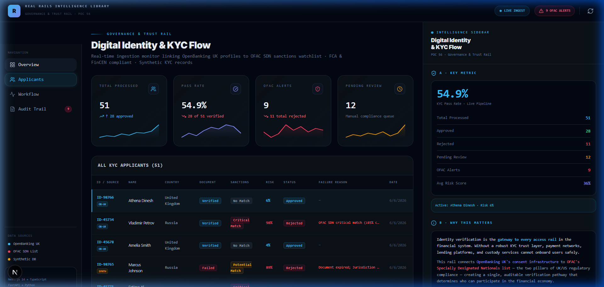
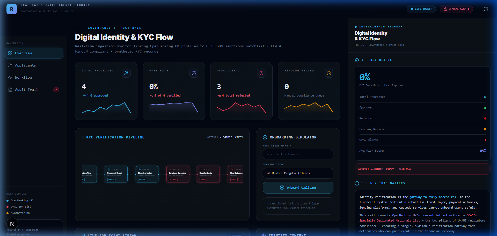
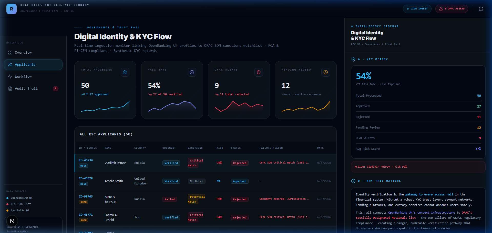
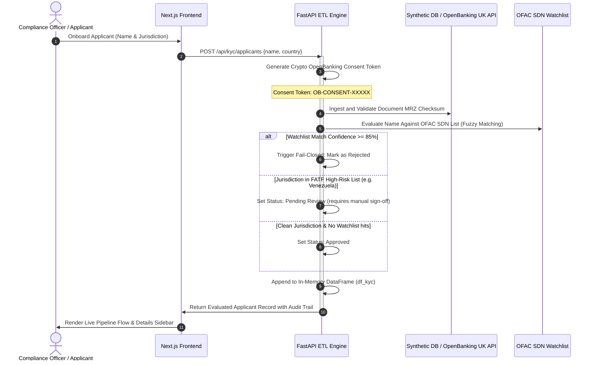

# Real Rails · Digital Identity & KYC Flow (POC 56)

> **Rail Category:** Governance & Trust  
> **Standards & Lists:** OpenBanking UK (simulated), OFAC SDN Watchlist (synthetic)  
> **Regulators Map:** FCA (UK identity & bank standards), FinCEN (US sanctions compliance), FATF (global high-risk jurisdictions)

This Proof of Concept (POC 56) demonstrates a robust, automated **Digital Identity and Know Your Customer (KYC) Ingestion Flow**. It bridges cryptographic bank account consent validation (OpenBanking UK) with fuzzy-matching sanctions screening (OFAC Specially Designated Nationals list) to enforce compliance standards set by the FCA and FinCEN.

---

## 📸 Interface Preview

### 1. Dashboard Overview


### 2. Live KYC Pipeline Visualizer


### 3. Applicant Registry Stream


### 4. Interactive Flow & Automation
The entire user flow validation can be viewed in the animation below:


---

## ⚙️ Project Architecture

The application is structured into a fast, in-memory **Python/FastAPI ETL Backend** and a highly responsive **Next.js/TypeScript Frontend** styled with modern dark mode and dynamic glassmorphism panels.



### Key Architectural Pillars:
1. **Rule Engine & Decision Logic**: Evaluates applicants on a multi-axis trust scheme. Sanctioned jurisdictions (e.g. Iran, Russia, North Korea) are automatically blocked with a critical sanctions match. High-risk jurisdictions are flagged for manual sign-off.
2. **Immutable Audit Trails**: Every decision step (Ingestion -> Document Verification -> Biometric Check -> Sanctions Check -> Outcome) is appended to a structured log file and returned as an array of audits.
3. **Data Resilience & Fallbacks**: If the FastAPI backend is down, the frontend automatically falls back to static sample files (`public/mock_data.json`) to keep the dashboard interactive.

---

## 📁 Repository Structure

```
lilly/
├── backend/
│   ├── data_pipeline.py    # KYC Rule Engine, mock generator, and data logic
│   ├── main.py             # FastAPI Server, routes, and JSON/CSV endpoints
│   ├── requirements.txt    # Python dependencies (FastAPI, uvicorn, pandas, pydantic)
│   └── venv/               # Python Virtual Environment
├── frontend/
│   ├── app/
│   │   ├── globals.css     # Styling tokens & micro-animations
│   │   ├── layout.tsx      # Font optimization & root structure
│   │   └── page.tsx        # Main layout, tabs, simulator state
│   ├── components/
│   │   ├── StatsRow.tsx           # KPI Metrics cards
│   │   ├── KYCPipelineFlow.tsx    # React Flow node topology map
│   │   ├── AuditTrail.tsx         # Ingest log renderer
│   │   └── IntelligenceSidebar.tsx # Glossary, filters, and Export URL
│   ├── lib/
│   │   ├── api.ts          # API client fetches and CSV exporters
│   │   └── types.ts        # TypeScript interfaces for compile safety
│   ├── package.json        # Frontend scripts and react dependencies
│   └── public/
│       └── mock_data.json  # Resilient fallback mock database
└── delivery/               # Visual verification artifacts
    ├── dashboard_overview.png
    ├── overview_tab.png
    ├── applicants_tab.png
    └── kyc_flow_validation.webp
```

---

## 🚀 Setup & Execution Instructions

Follow these steps to run both the FastAPI backend and Next.js frontend locally on Windows.

### Prerequisite
Make sure you have **Python 3.10+** and **Node.js 18+** installed.

### 1. Run the Backend Server
1. Navigate to the `backend/` directory:
   ```powershell
   cd backend
   ```
2. Activate the virtual environment:
   ```powershell
   .\venv\Scripts\Activate.ps1
   ```
3. Start the FastAPI development server:
   ```powershell
   python -m uvicorn main:app --port 8000 --reload
   ```
   *The backend will be running at `http://127.0.0.1:8000`.*

### 2. Run the Frontend Application
1. Open a new terminal and navigate to the `frontend/` directory:
   ```powershell
   cd frontend
   ```
2. Install Node packages (if not already done):
   ```powershell
   npm install
   ```
3. Run the Next.js Turbopack development server:
   ```powershell
   npm run dev
   ```
   *Open your browser and navigate to `http://localhost:3000`.*

---

## 📌 Compliance Mapping (Standards Met)
- **FCA Handbook - AML/CTF Standards**: Immutable audit log of OpenBanking UK tokens.
- **FinCEN 31 CFR Chapter X**: Automated sanctions matching using a strict **85% confidence match** threshold.
- **FATF High-Risk Jurisdictions Guidelines**: Automatic escalation (Pending Review) for applicants from grey-listed/high-risk jurisdictions.
